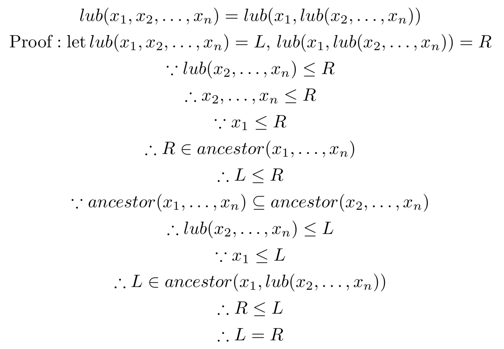

# Semantic Analysis

## Overall Structure

The following tasks are performed:

1. Check all classes are well-defined and build the inheritance graph.

2. Check the graph is acyclic.

3. Naming-scoping: Check basic definition errors and add all the attributes and methods (including ones inherited) to every class's declaration table.

4. Type-checking

## Inheritance Graph

Before the inheritance graph is built, several requirements need to be satisfied:

1. Classes are defined only once.

2. Parent classes are defined.

3. Basic classes `Int`, `Bool` and `String` are not inherited.

4. Class `Main` is defined.

The graph is represented by two symbol tables. The first one binds indices to class names and the second binds every class's parent's index to its own index. Then cycle detecting using DFS can be simply performed on the second symbol table. The C++ version of the algorithm can be found at [Detect Cycle in a Graph](https://www.geeksforgeeks.org/detect-cycle-in-a-graph/).

## Naming-Scoping

The basic idea is to record every class's attribute and method information, including the ones inherited. My implementation is to maintain two symbol tables `attr_declarations` and `method_declarations` in the ClassTable. For every class, create a new symbol table `curr_attr_declarations` in which attribute types are bound to the names and another one `curr_method_declarations` in which the entire method entities are bound to the names (because when type-checking dispatches formal types are needed). Then in `attr_declarations` and `method_declarations` the two symbol tables are bound to the class names. In order to record the feature information in the order that parent's features come first (since methods can be redefined and dispatches use the latest ones), recursive functions are used.

During naming-scoping the following errors need to be detected:

1. Attributes are redefined.

2. Methods are redefined improperly, i.e.
    * redefined in a single class
    * redefined with different return types
    * redefined with different number of formals
    * redefined with different formal types

3. Types declared are not defined

4. `self` appears in an attribute binding or a formal binding.

5. `SELF_TYPE` appears in a formal binding.

6. `main` is not defined.

7. `main` is defined with multiple parameters.

## Type-Checking

Type-Checking can be easily implemented with reference to the type rules specified in *The Cool Reference Manual*. With the help of the attr / method declaration tables, we can easily lookup feature information (notice the difference between `probe()` and `lookup()`) and add formals, let and case bindings. However there are two problems worth mentioning.

### `lub` Property

In the case expression, the lub of multiple types needs to be computed. Here is one proposal on `lub`'s property:

Therefore, we can update the lub in the loop.

### SELF_TYPE

`SELF_TYPE` is the trickiest part of the project. Though the formal rules with the notation of ` SELF_TYPE_C` are complicated, the implementation can be written in a concise way. Since we are performing type-checking in the unit of classes, whenever `SELF_TYPE` appears (in attributes, return types or method bodies, current or inherited) the ` SELF_TYPE_C` is actually the current class. So we can just lookup `self` in the current attribute declaration table.

Errors in this phase are:

1. Type mismatch

2. Dispatch parameter number mismatch

3. Type declared not defined

4. `self` appearing in a let binding or case binding
